# KMP

kmp算法是一种字符匹配算法。本文介绍kmp算法的设计思想，不涉及具体的代码实现。

本文中

- 将待匹配字符串称为**源字符串**，简称源串，用S[M]数组表示。
- 需匹配的字符串称为匹配**模式字符串**，简称模式串，用T[N]数组表示。
- 在一个字符串内任意取一段连续的字符串，我们称其为原字符串的**子串**。

1. kmp算法概念

​	为了了解kmp，我们先来看简单搜索算法原理。如图，我们用i，j变量分别指向源串、模式串里单个字符，让模式串和源串从开头进行匹配，匹配过程如下：

- 将i+j与j进行匹配，若模式串首个字符匹配成功，就递增j变量值，再进行下一个字符的匹配。循环直至模式串全部字符匹配成功退出或某个字符匹配失败转到下一步。
- 若模式串某个字符匹配失败，则将i+=1，即将匹配范围右移一个字符，而将j还原成j=1，重新进行上一步。
- 下图演示了某个匹配过程，其中源串直接使用i表示i+j

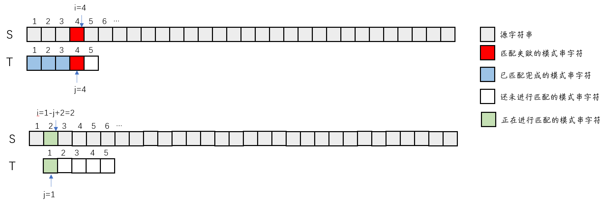

​	从逻辑上来说，当模式串与源串不匹配了，简单搜索算法会将模式串右拉一个字符位置再和源串进行比较。但是这无疑是很低效的，因为两者若有已匹配好的部分，将模式串右移一个字符后，该匹配部分大概率会被破坏。最坏情况下简单搜索算法时间复杂度为$$O(mn)$$。

​	如果能一次性将模式串右移尽可能多的位置，那么搜索的效率将大大提高，这就是kmp算法的基本思想。那么如何确定这个右移位置呢？为了解决这问题，我们来看看模式串右移的过程中，已匹配部分的变化，下图演示了该种变化。

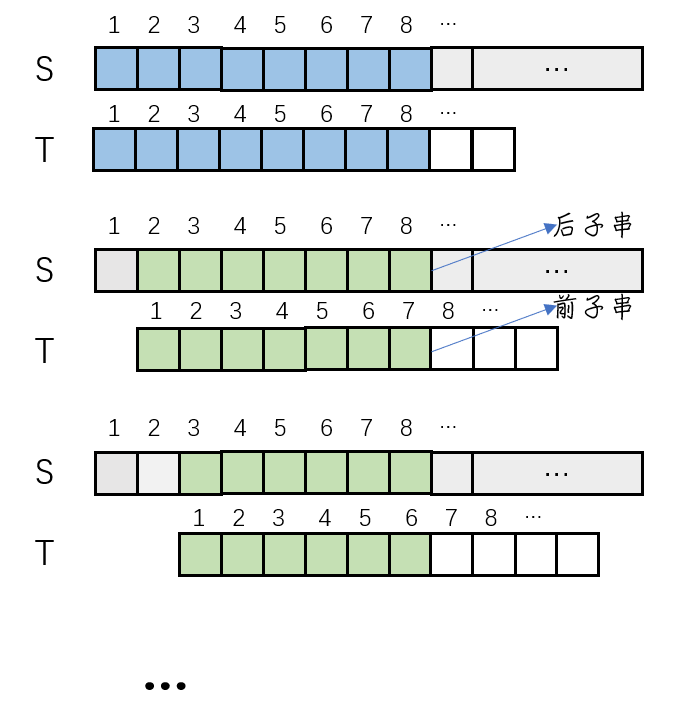

​	可以看到，在模式串不断右移过程中，两个串原本匹配范围会不断缩小，但是源串是在不断减少头部字符，尾部保持不会，模式串相反。两个串分别形成一个子串，本文中我们称模式串生成的子串为**前子串**，源串生成的子串为**后子串**，变化过程中前字串尾部不断减小，后子串头部不断减小。不难看出，在模式串右移过程中，当后子串和前子串相等时便可以停止右移，然后即可从前子串的下一个字符开始匹配。因此右移的位置就相当于匹配范围长度-前/后子串的长度。

​	这就是kmp算法匹配的基本原理，下图演示了KMP算法的一次流程，这里先不管算法的具体内容，对几个步骤进行说明：

- Step0：因为字符不匹配，所以模式串需要右移，已匹配的范围为8个字符
- Step1：KMP算法可以让我们直接将模式串右移2个位置，并得到大小为6个字符的相同前后子串，可以继续匹配之后的字符
- Step2：若仍然不匹配，KMP算法将模式串右移4个位置，得到大小为2个字符的前后子串，继续匹配
- Step3：依旧不匹配，此时KMP算法告诉我们匹配范围内已经没有相同的前后子串，因此直接右移到匹配范围之后开始重新比较。

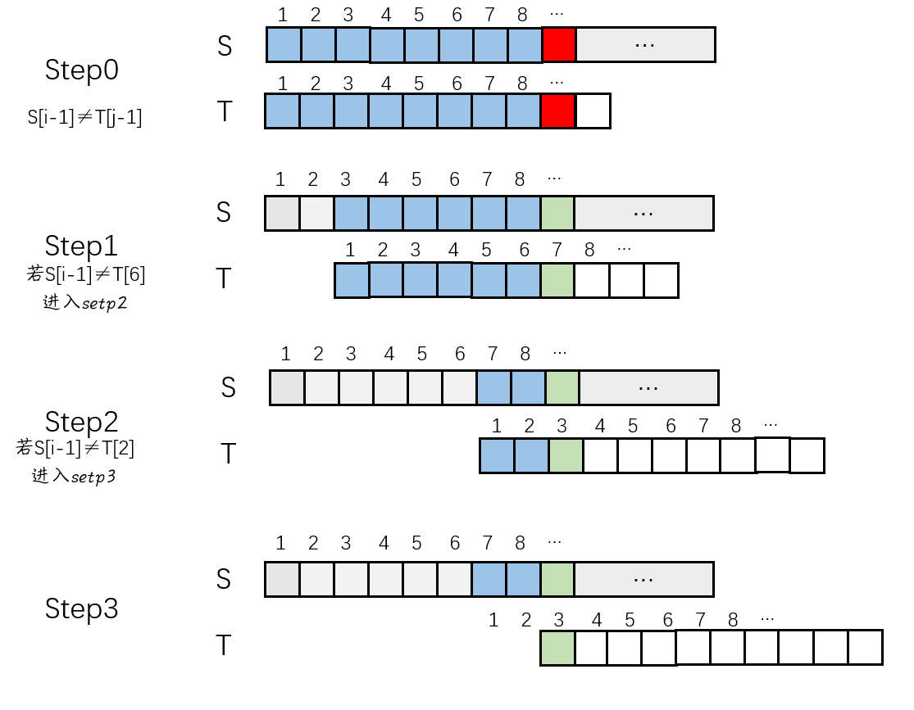

可以看出KMP算法在不断的将模式串右移合适的距离，KMP匹配的具体步骤如下：

- 在T[j]字符处匹配失败。
- 在匹配范围里找到子串，右移相应字符，完成后该子串即称为新的匹配范围。
- 将前子串后一个字符与源串相应字符进行比较，若成功则继续比较后面字符。此时匹配范围对应的扩大。
- 若匹配失败而回到第二步重新搜索子串，若不存在子串时则将模式串整体移动到相应字符位置。

至此，KMP基本原理相信读者已有一定了解。

## 2. next数组

​	事实上，模式串右移只是一种便于理解的图解形式，在程序中始终使用i，j指针来比较字符，模式串右移在程序中就是保持i变量不变，减小j变量，然后进行i，j变量的比较。尽管到目前本文一直将源串和模式串一同进行讲解，但实际上KMP始终仅仅关注模式串，下面来说明为什么仅关注模式串便可实现KMP。

​	在上一章可以看到KMP匹配4步中最重要的是第2步，也就是找到匹配范围里的子串。所以我们将目光转向这个匹配范围，匹配范围很明显是模式串的一个子串，即匹配范围大小不会大于模式串本身。因为匹配总是从模式串开头开始的，因此对于有N个字符的模式串，就存在N个不同的匹配范围，大小分别是`1，2，...，N`，当匹配范围大小为N时，便代表匹配成功。由于前后子串分别存在匹配范围的头尾部，因此M个字符大小的匹配范围，会各有M-1个前后子串，总共有2M-2个子串。KMP算法便是需要从这些前后子串中找到相同的前后子串，作为这个匹配范围内的子串，从而得到字串不匹配时该匹配范围下的模式串移动长度。如果一个匹配范围内有多个相同的前后子串，那么将其中最长的子串作为这个匹配范围的前后子串。

​	KMP算法仅需关注匹配范围，而该范围是相对于模式串来说的，永远不会大于模式串，这就是KMP算法仅需模式串的原因。回到KMP算法的实现，相同的前后子串用于确定每次匹配失败时模式串的右移长度，但是用字符串确定移动长度是非常不方便的。KMP算法建立了一个next数组保存每个匹配范围下的移动大小，当模式串第N个字符不匹配时，将N作为next数组的索引，得到的数组数值就是需要右移的长度。因此整个匹配过程就可以大大简化。

下图和第一章的演示过程是一样的，但给出了kmp算法在next数组下的处理过程：

- Step0：第9个字符不匹配，得到8个字符的匹配范围，搜索next[9]数组得到7，代表将源串该字符与模式串第7个字符进行比较
- Step1：依然不相等，此时匹配范围大小为6，第7个字符不相等，因此搜索next[7]得到3
- Step2：引燃不相等，搜索next[3]得到1，说明已经没有相同的前后子串，需要重新开始匹配

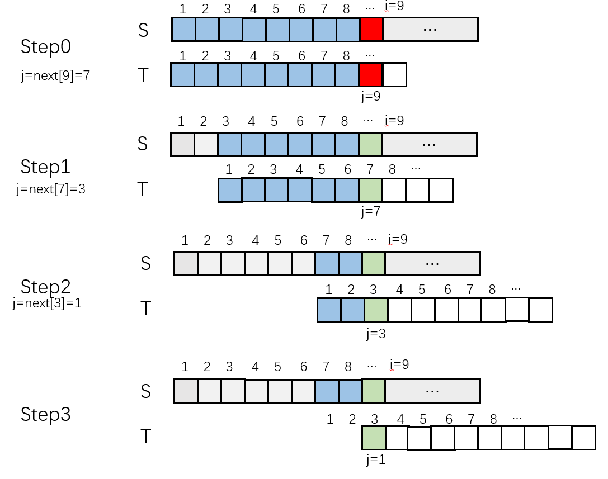

## 3. 建立next数组

​	有next数组后一切都变得很容易，那么问题来了，要怎么建立next数组呢？这里有两个方法，一个适用于手工计算，容易理解。另一个较为高效，但难以理解。

​	对于有N个字符的模式串，将next数组大小也设置为N，其中我们固定设置next[0]=0，next[1]=1（不存在j=0的情况，j=1时没有匹配范围，j=N时代表匹配成功了，无需next数组）。

### 3.1 手工计算next数组

​	手工计算先写出两个相同的匹配范围，一个从头部开始划字符，一个从尾部开始划字符，看前后子串是否相等，最先相等的子串到的就是该匹配范围的子串，然后将子串大小+1，赋值给next[j]，其中j为该匹配范围大小+1。当模式串j处字符不匹配时，即可使用next[j]得到移动长度。对于一个长度为N的模式串，有`1,...,N-1`个匹配范围，因此需要对每个匹配范围都进行这样的计算得到最终的next数组。

​	手工计算适合需要对某些指定的匹配范围长度进行计算，但不要求得到所有的next数组数值的情景下使用，比如做题。

### 3.2 高效计算next数组

​	高效计算next数组是本文最后一部分内容，也是kmp算法中最难的部分。它的目的就是通过next[j]值求出next[j+1]，因为next[0]、next[1]是直接初始化的，因此我们就可以根据两个值算出整个next[i]数组。下图演示了next[j]到next[j+1]的变化过程：

- Step0：当j=12是字符串匹配失败，此时假设next[12]=7，将T右移

  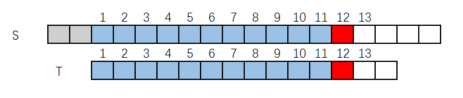

- Step1：此时状态如图所示，T[7]将与S[12]进行比较，因为前后子串相等，因此T[1-6]=T[6-11]

  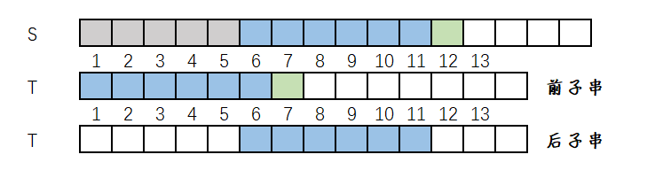

  

- Step2：因为要根据next[12]求得next[13]，将目光放在模式串T上

  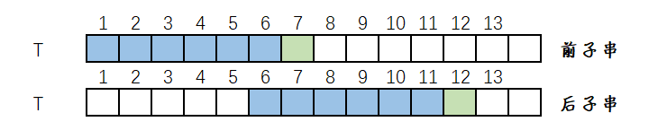

- Step3.1.1：当T[7]=T[12]时，可以得到前子串T[1-7]=后子串T[6-12]

  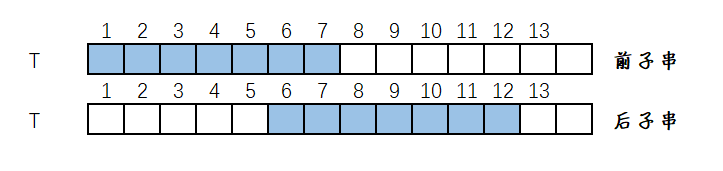

- Step3.1.2：如果该子串是12字符大小匹配范围下的最大子串，那么就求得next[13]=next[12]+1=7+1=8。为了证明，用假设法假设还有更大的子串，比如大小为9的子串存在，因此有T[1-9]=T[4-12]

  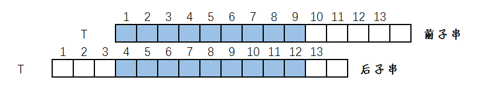

- Step3.1.3：此时我们返回思考11大小匹配范围的前后子串，可以看出有T[1-8]=T[4-11]，计算得next[12]=9，而next[12]=7，说明11大小匹配范围内最大相同前后子串长度为7，不可能存在比7更大的子串，因此12大小匹配范围也不存在有比8更大的匹配范围。如此，便证明了当T[7]=T[12]时，得到next[13]=next[12]+1=7+1=8

  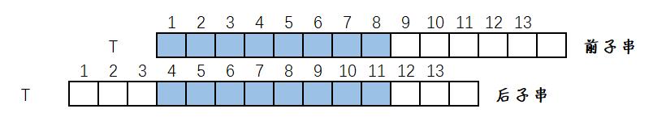

- Step3.1.4：

  - 反证法能成立是因为当某个匹配范围的next数组存在时，不论将匹配范围扩大还是缩小，都仅对前后子串的串尾字符进行处理，而不影响前后子串中前面已匹配的部分，因此相邻匹配范围的next数组数值最多增加1。
  - 以小推大建立next数组，在已有某个匹配范围的最大相同前后子串的基础上，扩大匹配范围仅会对比前后子串各自的后一个字符是否相等，而前后子串对应部分依然相等。而扩大的匹配范围又根据反证法得到不会有更大的前后子串，如此便完成了以小推大。

- Step3.2.1：当T[7]$\neq$T[12]时，可以看到此时前后子串已经不相同，需要重新寻找相同的前后子串

  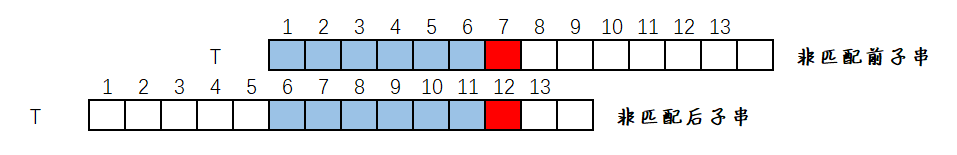

- Step3.2.1：由Step3.1知此时也不可能有更大范围的前后子串，我们仅能在上一步的前后子串中寻找

  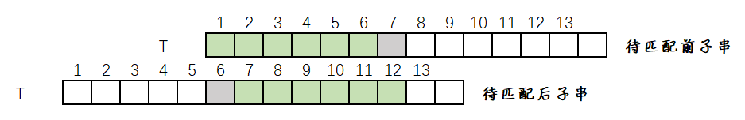

- Step3.2.2：寻找新的相同前后子串肯定要尽可能高效，仔细思考可以发现，此时尽管前后子串都是模式串，但已经可以把后子串视作新的源串，前字串作为新的模式串，我们需要在前字串中找到某个和后子串相同的匹配范围

  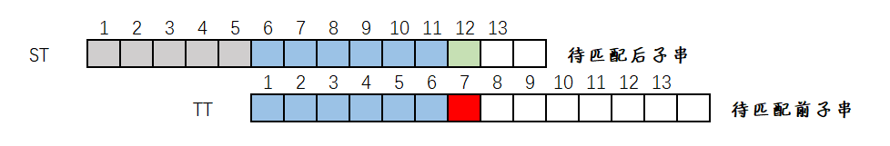

- Step3.2.3：可以看到，有大小为6的匹配范围，而next[7]数组已然建立(因为next数组建立从小到大，当求next[13]时，0-12都已建立完成)。因此我们可以直接根据next[7]的值右移TT串，假设next[7]=4，移动后效果如图

  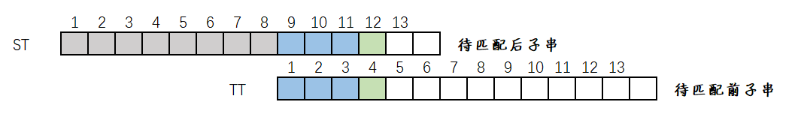

- Step3.2.4：此时如果T[4]=T[12]，那么根据Step3.1得到next[13]=next[7]+1=4+1=5。若T[4]$\neq$T[12]，那么继续搜索next[4]，直到得到最终相等的值，如果都不想等，将有next[13]=1，代表T[1-6]和T[7-12]中没有相同得前后子串，当匹配不成功时匹配范围为12的话，那么这段匹配范围内已经没有相同的前后子串，需要从头遍历。

- Step4：到此已经完成了根据next[12]建立next[13]的所有步骤，根据这步骤依次建立完next数组，即可开始使用KMP算法进行搜索。

## 4.总结

​	到此为止本文主要内容就结束了，最后是我对这节算法的理解和一些说明，读者若对上述利用next[j]找匹配子串的过程感到疑惑请继续阅读。

​	首先便于理解可以将后子串看作一个新的源串，具有源串中字符不匹配时待匹配位置不变的特点，前子串看作新的模式串，具有待匹配位置改变的特点，比如Step3.2.2中，后子串第12个字符始终不变，和前子串字符进行匹配，而前子串的匹配字符一直变化，直到遇到和后子串不变待匹配字符相同的字符。

​	和实际源串模式串不同的是，前后子串大小时刻改变，而实际字符串不会变化。当两个串待匹配位置字符相同时，即找到了对应匹配范围的next数组值，大小为前子串长度+1。Step3.2情况实际上就是在上个next数组的匹配范围内快速找到新的匹配范围，然后重新测试前后子串待匹配字符是否相同，如果相等，那么新匹配范围长度+1就是新的next数组值。

​	本节算法下的KMP算法总的时间复杂度为$$O(m+n)$$。像作者这种数学很一般又不是以算法吃饭的人，理解KMP已属不易，理解时间复杂度就更难了，待日后有机会再看看能不能理解。
